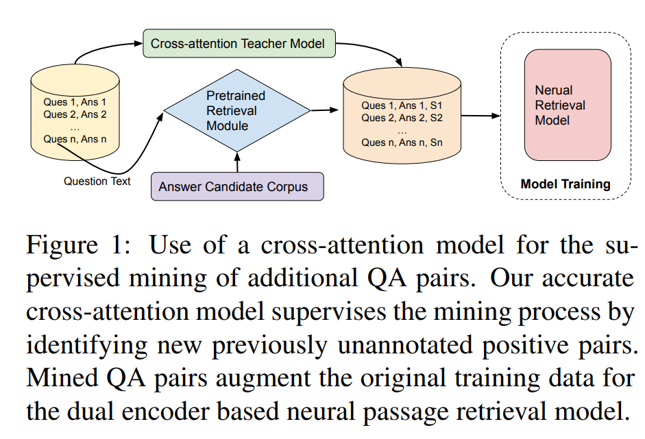

# Training a text grader: 
### Available Input: 
- LLM Text + embedding
- Question Text + embedding 
- Human Text + embedding
- Retrieved top K chunks + embedding 
- Label: Human grade
  - General/ Similarity
  - Correctness
  - Coherence
  - Prompt Alignment
  - Specificity

### Feature Engineering:
- Distance calculation between 
  - LLM Text, Human Text
  - Qestion Text, Human Text
  - Question Text, LLM text
  - Question Text, Chunk Text (embed altogether)
- 

### Ideas:
- Candidate Metrics:
  - Predict a score
  - MRR: Rank answers based on scores
  - P@N: precision at N 
  - ReQA evaluation: 
    - paper: https://aclanthology.org/D19-5819.pdf
    - code: https://github.com/google/retrieval-qa-eval/blob/master/squad_eval.py
  - SQuAD metrics: https://huggingface.co/spaces/evaluate-metric/squad/blob/main/compute_score.py
    - Computes F1, match scores based on token overlap between candidate sentences and ground truth 
- Cross attention classification model: https://arxiv.org/pdf/2009.13815.pdf
  - 
  - Given gold question passage pairs,we first train a cross-attention classification model as the supervisor (BERT-based). 
  - Then any collection of questions can be used to mine potential question passage pairs under the supervision of the cross-attention model
  - finetuning BERT:
    - https://towardsdatascience.com/bert-explained-state-of-the-art-language-model-for-nlp-f8b21a9b6270
    - https://medium.com/swlh/fine-tuning-bert-for-text-classification-and-question-answering-using-tensorflow-framework-4d09daeb3330
    - https://aclanthology.org/N19-1423.pdf
    - https://colab.research.google.com/drive/1uSlWtJdZmLrI3FCNIlUHFxwAJiSu2J0-#scrollTo=bT5ESKDxfnLf
    - https://huggingface.co/docs/transformers/tasks/question_answering

    BERT FINETUNING FOR QA: 
    - Get Start End idx:
      - For each Correct answer, Context pair: Identify if tokens are in Context
        - Identify key tokens in answer
        - Get idx of tokens in context 
      - Compute logits in context for answer by predicting for each token, the likelihood it would be a start or end token for an answer 
        - p(ans_start), p(ans_end)
- Direct Scoring model on top of embeddings
  - BERT -> dropout -> dense output
    - Input: 
      - Concat Tokens: [CLS] A_human [SEP] A_LLM padded to max_token_len [SEP]
      - Input Mask: indicates where token is masked for attention layer 
      - Type: Indicates if part of sentence 1 or 2
  - Available Embedding model
    - 

- Negative sampling: 
- 

